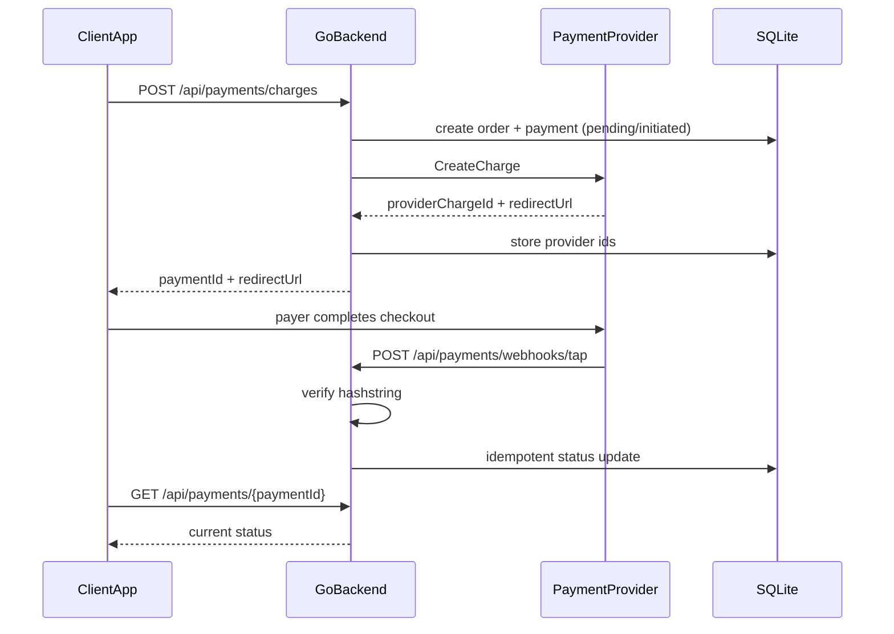

# Tap Payment (Ethiopia-ready) — Monorepo

Provider-agnostic payments backend designed around Tap’s charge + redirect + webhook model, with an Ethiopia-ready API surface (`+251`, `ETB`) and room to plug in local gateways later.

## What’s in this repo

| Path | Purpose |
|------|---------|
| `backend/` | Go payments API (stable, concurrent) |
| `openapi/` | OpenAPI contract (API source of truth) |
| `sdk-typescript/` | TypeScript client matching the OpenAPI contract |
| `docker-compose.yml` | Local backend run |
| `.github/workflows/ci.yml` | Go tests on push/PR |

## Architecture



### Provider abstraction

App-facing APIs stay stable. Gateways implement one interface:

- `tap` — real Tap Payments create-charge flow
- `mock` — local/dev provider (no external keys)
- future: `chapa` / `telebirr` for Ethiopia settlement

Select with `PAYMENT_PROVIDER=tap|mock`.

## Quick start

### Option A — local Go

```bash
cp backend/.env.example backend/.env
# PAYMENT_PROVIDER=mock is fine for local demos
cd backend
go run ./cmd/api
```

### Option B — Docker

```bash
docker compose up --build
```

Health check: `GET http://localhost:8080/healthz`

### Create a charge (mock)

```bash
curl -sS -X POST http://localhost:8080/api/payments/charges \
  -H 'Content-Type: application/json' \
  -d '{
    "orderId": "ord_001",
    "amount": 100,
    "currency": "ETB",
    "customer": {
      "firstName": "Abebe",
      "lastName": "Kebede",
      "email": "abebe@example.com",
      "phone": { "countryCode": "251", "number": "911234567" }
    }
  }'
```

## API

- `POST /api/payments/charges` — create charge, return redirect URL
- `POST /api/payments/webhooks/tap` — Tap webhook (`hashstring` verified, idempotent)
- `GET /api/payments/{paymentId}` — payment status

Errors are structured:

```json
{ "error": { "code": "INVALID_INPUT", "message": "..." } }
```

## TypeScript SDK

```ts
import { createApiClient } from "./sdk-typescript/src";

const api = createApiClient({ baseUrl: "http://localhost:8080" });
const payment = await api.createCharge({ /* ... */ });
```

## Design tradeoffs

- **Go backend**: predictable concurrency and a small deployable binary for a payments core.
- **SQLite first**: fast local setup; schema is simple enough to move to Postgres later.
- **OpenAPI + TS SDK**: apps depend on a stable contract, not Tap’s raw API shape.
- **Honest Ethiopia stance**: Tap does not currently onboard Ethiopian merchants for settlement. This project mirrors Tap’s integration patterns and keeps provider swapping ready for local gateways.

## Roadmap

- [x] Charge + webhook + status API
- [x] Validation, structured errors, webhook idempotency tests
- [x] OpenAPI + TypeScript SDK
- [x] Docker + CI
- [x] Provider interface (`tap` + `mock`)
- [ ] Ethiopian provider adapter (Chapa / Telebirr)
- [ ] Refunds + admin auth
- [ ] Postgres + reconciliation jobs

## Tests

```bash
cd backend && go test ./...
```
