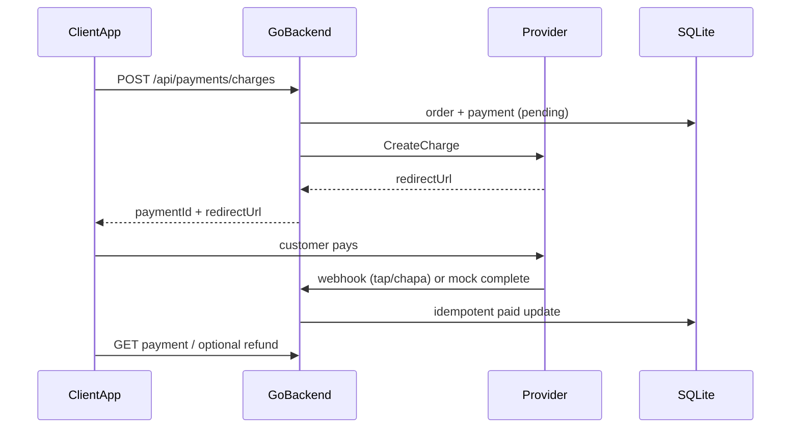

# Tap Payment (Ethiopia-ready) — Monorepo

Provider-agnostic payments platform: Go backend + OpenAPI + TypeScript SDK.
Supports **mock** (local demos), **Tap** (GCC-style charges), and **Chapa** (Ethiopia / ETB).

## Repo layout

| Path | Purpose |
|------|---------|
| `backend/` | Go payments API |
| `frontend/` | Next.js checkout demo (BirrPay) |
| `openapi/` | OpenAPI contract |
| `sdk-typescript/` | TypeScript client |
| `docker-compose.yml` | Local run |
| `.github/workflows/ci.yml` | CI tests |

## Architecture



### Providers (`PAYMENT_PROVIDER`)

| Value | Use |
|-------|-----|
| `mock` | Local demo with HTML checkout (no keys) |
| `tap` | Tap Payments create-charge + hashstring webhooks |
| `chapa` | Ethiopian Chapa initialize + signed webhooks |

## Quick start

### Backend + frontend (recommended demo)

```bash
cp backend/.env.example backend/.env
# terminal 1
cd backend && go run ./cmd/api
# terminal 2
cd frontend && npm install && npm run dev
```

Open `http://localhost:3000` → create a payment → complete mock checkout → land on status page.

Or with Docker:

```bash
docker compose up --build
```

- Frontend: `http://localhost:3000`
- API: `http://localhost:8080`

### Full mock payment flow

```bash
# 1) Create charge
curl -sS -X POST http://localhost:8080/api/payments/charges \
  -H 'Content-Type: application/json' \
  -d '{
    "orderId":"ord_001",
    "amount":100,
    "currency":"ETB",
    "customer":{
      "firstName":"Abebe",
      "lastName":"Kebede",
      "email":"abebe@example.com",
      "phone":{"countryCode":"251","number":"911234567"}
    }
  }'

# 2) Open redirectUrl in a browser and click "Pay successfully"
# 3) Check status
curl -sS http://localhost:8080/api/payments/<paymentId>

# 4) Refund (admin)
curl -sS -X POST http://localhost:8080/api/payments/<paymentId>/refund \
  -H 'Content-Type: application/json' \
  -H 'X-Admin-API-Key: dev-admin-key' \
  -d '{}'
```

## API

- `POST /api/payments/charges`
- `GET /api/payments/{paymentId}`
- `POST /api/payments/{paymentId}/refund` (requires `X-Admin-API-Key`)
- `POST /api/payments/webhooks/tap`
- `POST /api/payments/webhooks/chapa`
- `GET /mock/checkout/{chargeId}` + `POST .../complete` (mock only)

## TypeScript SDK

```ts
import { createApiClient } from "./sdk-typescript/src";

const api = createApiClient({
  baseUrl: "http://localhost:8080",
  adminApiKey: "dev-admin-key",
});
```

## Design notes

- **Go** for a stable concurrent payments core.
- **Provider interface** so Ethiopia (Chapa) and GCC (Tap) share one app API.
- **Honest Ethiopia stance**: Tap merchant onboarding is GCC-focused; Chapa is the local settlement path.
- **SQLite** for easy demos; Postgres can replace later without changing the public API.

## Tests

```bash
cd backend && go test ./...
```

## Status

- [x] Charge + webhooks + status
- [x] Validation / structured errors / idempotency tests
- [x] OpenAPI + TypeScript SDK
- [x] Docker + CI
- [x] Provider interface (`mock`, `tap`, `chapa`)
- [x] Mock checkout completion
- [x] Refunds + admin API key
- [ ] Optional later: Postgres, Telebirr, reconciliation workers
