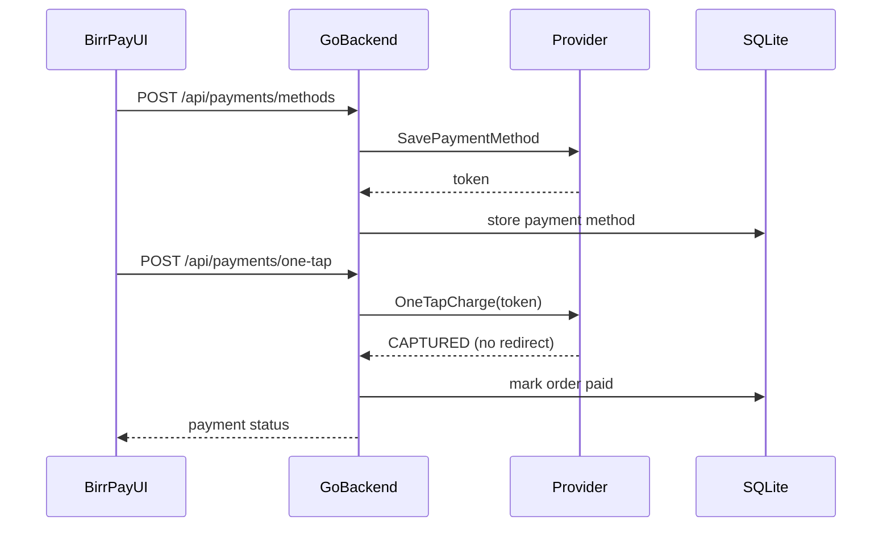

# Tap Payment (Ethiopia-ready) — Monorepo

**Primary UX: one-tap payments** — save a method once, then pay with a single button (no redirect).

Also supports classic redirect checkout for Tap/Chapa when needed.

## Repo layout

| Path | Purpose |
|------|---------|
| `backend/` | Go payments API |
| `frontend/` | Next.js one-tap demo (BirrPay) |
| `openapi/` | OpenAPI contract |
| `sdk-typescript/` | TypeScript client |
| `docker-compose.yml` | Local run |
| `.github/workflows/ci.yml` | CI tests |

## Architecture (one-tap)



### Providers (`PAYMENT_PROVIDER`)

| Value | One-tap | Redirect checkout |
|-------|---------|-------------------|
| `mock` | Yes (demo) | Yes |
| `tap` | Stub (needs saved-card) | Yes |
| `chapa` | Stub (future) | Yes |

## Quick start

```bash
cp backend/.env.example backend/.env
# terminal 1
cd backend && go run ./cmd/api
# terminal 2
cd frontend && npm install && npm run dev
```

Open `http://localhost:3000`:

1. **Enable one-tap** (save wallet/card once)
2. Tap **Pay … · one tap**
3. Land on status as `CAPTURED` / paid

## API

One-tap:
- `POST /api/payments/methods` — save payment method
- `GET /api/payments/methods?customerKey=...` — list methods
- `POST /api/payments/one-tap` — charge with saved method (no redirect)

Also available:
- `POST /api/payments/charges` — classic redirect checkout
- `GET /api/payments/{paymentId}`
- `POST /api/payments/{paymentId}/refund` (`X-Admin-API-Key`)
- Tap/Chapa webhooks

## Tests

```bash
cd backend && go test ./...
```
